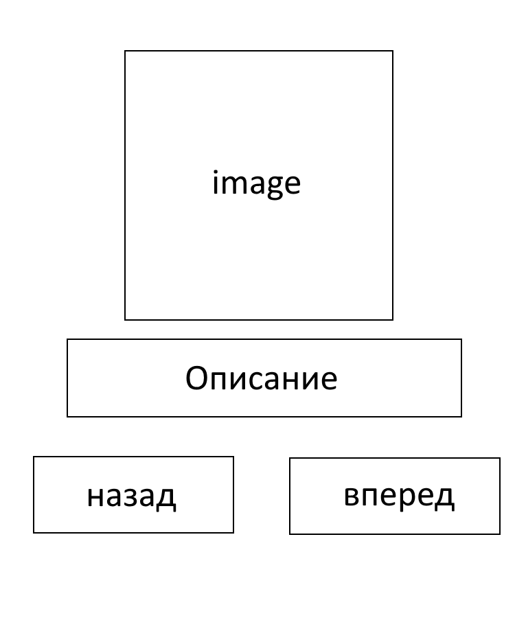

# Лабораторная работа №9. Создание приложения на основе Jetpack Compose

### Элементы использованы

* Composable функции
* UI компоненты
* Модификаторы расположения

### Логика

* `personList` - запоминает список персонажей
* `currentPage` - отслеживает текущий индекс
* `currentPerson` - текущий персонаж для отображения
* Циклическая навигация
* Работа с ресурсами

### Технологии

* Kotlin
* Jetpack Compose
* Android Studio

### Low-fi прототип

